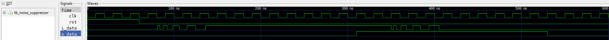

# Cuestionario de entrenamiento TAdE-2024

## Ejercicio 1

Realice una descripción en VHDL de un __contador ascendente de N bits__. La cantidad de bits del contador debe ser definida por un __parámetro genérico__ en el componente con el nombre de __g_dataSize__. El contador debe reiniciar su salida de conteo (__o_data__) si esta se iguala al valor de entrada __i_data__, en esta transición la salida __o_end__ se establece en __'1'__ indicando el reinicio del conteo. Implemente su descripción en un fichero con el nombre __counter.vhd__. Este diseño debe pasar las pruebas que se le realicen en el test-bench adjunto __tb_counter.vhd__.

```text
                  ________________________________
            en  -|  i_en           o_data(N-1..0) |= count(N-1..0)                           
  limit(N-1..0) =|  i_data(N-1..0)                |                  
                 |                                |                   
            clk -|> i_clk                         |                   
            rst -|  i_rst                   o_end |- end_count                     
                 |________________________________|                   
                          (N bits counter)
```

___

## Ejercicio 2

EL componente __noise_suppresor.vhd__ reutiliza el componente __counter.vhd__ previamente diseñado. Este componente cumple la función de eliminar el ruido proveniente de una señal digital y dar una salida actualizada solo cuando la señal de entrada se mantiene estable durante una cantidad de pulsos de reloj establecida en el parámetro genérico __g_nClkIgnore__. Diseñe un __test-bench__ que permita evaluar el comportamiento del circuito y definir si es correcto o no.



### Componente (_noise_suppresor.vhd_)

```VHDL
    component noise_suppressor is
        generic(
            g_nClkIgnore : integer
        );
        port(
            i_clk  : in std_logic;
            i_rst  : in std_logic;
            i_data : in std_logic;
            o_data : out std_logic
        );
    end component noise_suppressor;
```
